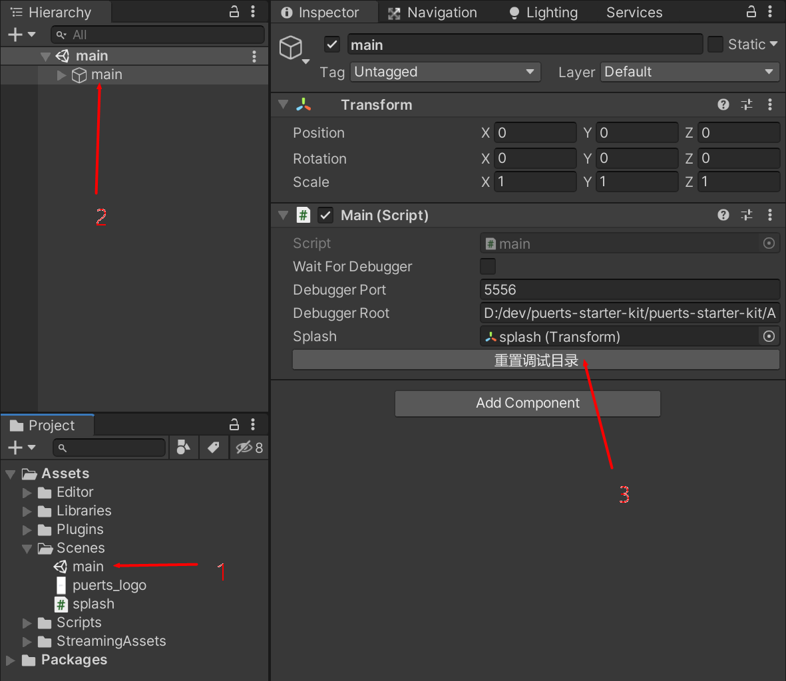
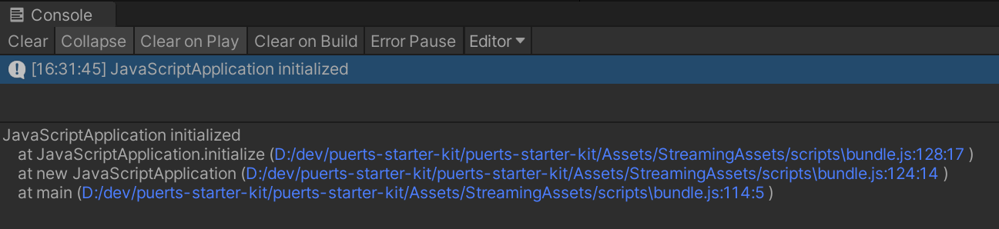
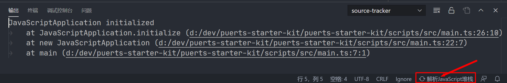
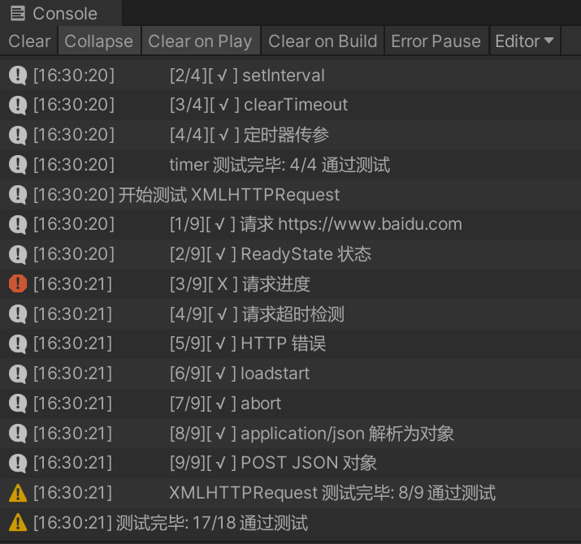

### Unity Puerts 起始项目

使用腾讯的 [puerts](https://github.com/Tencent/puerts) 的 Unity 空项目，搭建好 TypeScript 编译调试工具，IDE配置等常用手脚架，不含任何游戏框架。

提供 [webapi 兼容层](https://github.com/GodotExplorer/WebAPI)，实现部分常用的 WebAPI，并针对 Unity 优化了 console API。

### 必备知识
- Unity 基础使用
- TypeScript/JavaScript 语言
- NodeJS 和 npm/yarn

没用过上述任何一项的请关闭此页面，也请不要向作者提问。

### 如何使用

0. 确保已安装如下所需的开发工具
- NodeJS
- Visual Studio Code
- Unity 2019.4.9 (其他版本未测试)
1. 克隆该项目，项目结构如下
    - `.` 普通 Unity 项目
    - `Scripts` TypeScript 项目目录
    - `Scripts/src` 项目源代码目录
    - `Assets/Libraries/Puerts` puerts 代码
    - `Assets/Plugins/Puerts` puerts 各个平台的二进制库
    - `Assets/Editor/PuertsConfig.cs` puerts 导出配置
    - `Assets/Scenes/main.unity` 入口场景
    - `Assets/StreamingAssets/scripts` 编译生成的 JavaScript 脚本
2. 安装依赖：进入 `Scripts` 目录执行 `npm install` 或 `yarn install`
3. 使用 VSCode 打开该项目，执行以下 npm 命令编译 JavaScript 库
    - `npm run webapi:publish` 或 `yarn webapi:publish` 编译 WebAPI 兼容库
    - `npm run bundle:dev` 或 `yarn bundle:dev` 启动项目编译服务
4. 使用 Unity 打开 `Assets/Scenes/main.unity` 入口场景，点击`重置调试目录` 将脚本目录设置为你的本机目录

5. 点击运行，启动游戏，如果一切顺利可以看到如下的日志，大功告成

### 调试
- Unity 顺利启动JavaScript项目后可在 VSCode 中按 `F5` 键添加到运行中的调试器，之后便可在 typescript 文件中设置断点。
- 如需要调试启动相关的JavaScript代码，请在入口场景中选中`main`节点，勾选 `Wait For Debugger` 选项框。启动游戏后Unity会等待VSCode调试器连接，此时到VSCode中需要调试地方设置好断点后按`F5`连接调试器。

### npm 命令简介
| 命令  |  功能 |
|---|---|
|bundle:dev| 启动`main.ts`为入口的编译服务，项目中的脚本变动会自动增量编译到 `bundle.js` |
|bundle:publish| 使用发布模式编译 `bundle.js` |
|bundle:analyze| 使用发布模式编译 `bundle.js` 并打开源代码分析服务 |
|webapi:dev| 启动 webapi 模块的编译服务 |
|webapi:publish| 使用发布模式编译 webapi 模块 |
|test| 启动单元测试的编译服务 |
|tslint| 执行代码静态分析 |

上述所有命令可以在在VSCode编辑的 NPM 脚本面板中一键启动

### JavaScript 堆栈解析
项目代码打包为 bundle.js 后所有日志、和异常的报错均来自。建议为VSCode安装 [source-tracker 插件](https://marketplace.visualstudio.com/items?itemName=geequlim.source-tracker) 用于解析bundle中的JavaScript堆栈信息。
在Unity中复制日志或异常的报错信息，VSCode 安装source-tracker后右下角会多一个 `解析JavaScript堆栈` 按钮，点击后即可从剪切板解析到源代码的堆栈，可点击链接进行跳转。

### 单元测试

提供简单的单元测试，支持表达式、函数、Promise 三种测试规则，能够覆盖大多数单元测试需要。测试入口在 `Scripts/src/test/GameTest.ts` 脚本中，可参考现有例子使用。

执行 test 单元测试后编译单元测试代码，Unity中运行项目可以进行单元测试

### 如何下载远程脚本、执行脚本热更新流程 ？
自行实现 JavaScriptLoader 接口实现